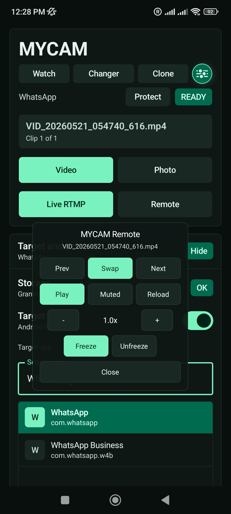
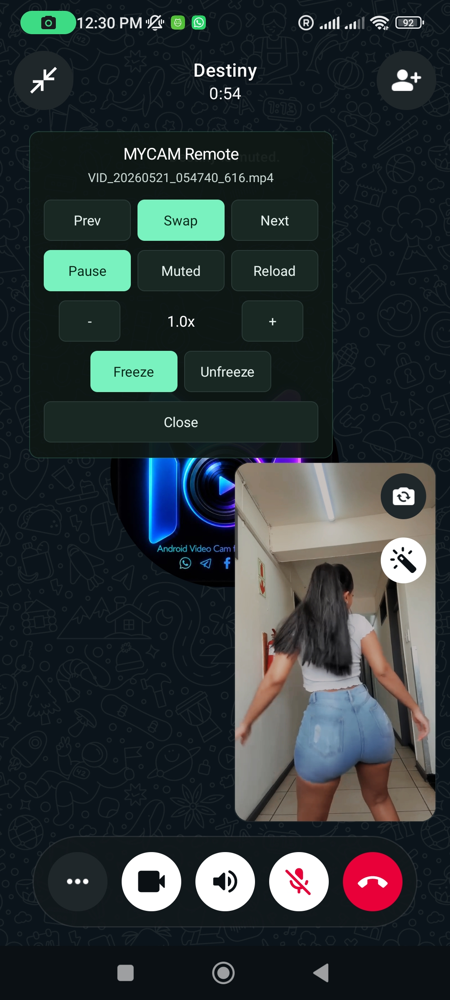

# MYCAM

Official download and support page for MYCAM, an Android virtual camera tool for rooted phones with LSPosed.

By downloading or using MYCAM, you agree to the [MYCAM Terms of Use](TERMS.md).

## Download

[Download MYCAM v2.1.13](https://github.com/elementtime6969/mycam/raw/main/downloads/Mycam-v2.1.13.apk)

Scroll down to learn more about MYCAM and OBS setup ↓

## What MYCAM Does

MYCAM replaces the normal Android camera feed inside supported apps. It hooks into Android Camera1 and Camera2 flows, including preview, capture session, and ImageReader paths, so a selected target app can receive controlled virtual camera video instead of the physical camera feed.

MYCAM can swap the live camera during calls or camera sessions with:

- Pre-recorded video from the phone.
- Local media selected inside MYCAM.
- OBS livestream video through Live RTMP.
- A local MediaMTX server running on the same private Wi-Fi network.

Supported workflows include:

- **Video mode** for selected clips.
- **Photo mode** for selected images.
- **Live RTMP** for OBS-to-phone streaming.
- **Watch mode** to keep MYCAM ready when the target app opens the camera.
- **Remote controls** for swap, play/pause, reload, freeze/unfreeze, speed, mute, previous, and next.
- **Clone mode** for creating separated supported social app profiles for accounts you own.
- **Android ID changer** for testing, app-profile isolation, and supported cloned app environments.

MYCAM is designed for supported camera apps and social media apps that use Android camera APIs, including Instagram, WhatsApp, WhatsApp Business, Messenger, TikTok, Telegram, Snapchat, Facebook, and other supported apps that open the Android camera.

Use MYCAM only with your own accounts, devices, and content, and follow the rules of the apps and platforms you use.

## Use Cases

### Control MYCAM While A Target App Is Active

Use MYCAM Remote to swap media, pause or play, reload, freeze or unfreeze, change speed, mute, and move between clips while the selected target app is using the virtual camera.

### Replace A Live Call Camera With Pre-recorded Video

MYCAM can hook the target app camera during a live call or camera session and swap the physical camera feed with selected pre-recorded video, local media, or OBS RTMP output.

## Current Version

| Field | Value |
| --- | --- |
| App | MYCAM |
| Package | `com.destiny.mycam` |
| Version | `2.1.13` |
| Version code | `22` |
| APK file | `downloads/Mycam-v2.1.13.apk` |
| APK size | `7,235,745` bytes |
| APK SHA-256 | `C985AEF7DA01EFFFB93A1C25FD428CA89CC9AD30A69713B20D28C21EA952D6B3` |
| Published | `2026-07-18` |

## Requirements

- A rooted Android phone.
- LSPosed installed and enabled.
- The selected target app must be enabled in LSPosed for MYCAM.
- Live RTMP requires the MYCAM Windows tools package when streaming from OBS.

## Install

1. Download the APK from the link above.
2. Open the APK on your Android device.
3. If Android asks, allow installs from the browser or file manager you used.
4. Follow the [MYCAM setup guide on YouTube](https://youtu.be/p78_HDo5FuM?si=5j9zeaI28PN4RjQJ).
5. Open MYCAM after installation.

MYCAM uses a server-side update and integrity gate. First launch requires internet so the app can verify the official build.

## Live RTMP Tools

Live RTMP support uses a companion Windows tools package with the local media server files and OBS setup needed for optional livestreaming from OBS to MYCAM.

- Setup guide: [MYCAM Live RTMP setup](docs/live-rtmp-setup.md)
- Tools package: [MYCAM-Live-RTMP-tools.rar](https://github.com/elementtime6969/mycam/releases/download/live-rtmp-tools-v2/MYCAM-Live-RTMP-tools.rar)

## Support And Comments

Use [GitHub Issues](https://github.com/elementtime6969/mycam/issues) for comments, bug reports, and download problems.

## Repository Policy

This repository is for official MYCAM downloads, Live RTMP setup documentation, and user comments only. The MYCAM source code is not published here, and code contributions are not accepted.
